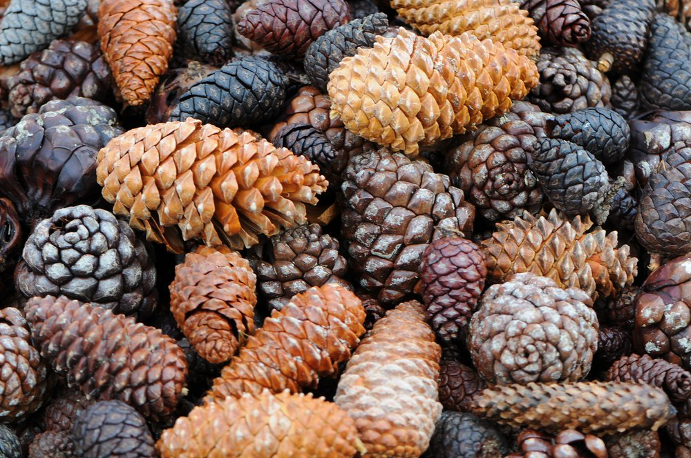

*The idea of establishing an open and ongoing conversation with the world of Nature is central to coming of age initiation traditions in many traditional and indigenous cultures. Maybe it’s time the rest of us remembered how to do it as well.*

I used to live in the USA, in northern New England, specifically in Vermont. The town was really a village of eight-hundred people, more cows, and even more sheep. I could walk out my back door, cross a brook and a hay field, and enter a hardwood forest deep in moss, ripe with the scent of rotting leaves and mushrooms. Coyotes sang their harmonies at night, hawks danced the skies, and one year a mountain lion passed through. Deer and moose were everywhere. We called it home as well, and while we all knew there were deeper woods to be found, for visitors from the city it constituted wilderness.

Two and a half hours’ drive to the south lay Boston: friends and relatives, business contacts, urban culture, goods and services not to be found in Vermont. It was on one of my semi-annual forays to the city that I happened upon an odd little shop which came to exemplify a trend I found astonishing. The shop had apparently opened for the Christmas season and sold an array of wrapping materials and decorations for D.I.Y. decorating.

What made it unique in Boston was that everything supplied was as raw and direct from nature as possible. In rows of boxes and bins there was held an array of pine cones, acorns, twisty little twigs, bright bits of tree bark, bags of fresh green moss, and sheets of hand made paper. Almost all were items I could have picked off the ground at home, for free. Here they were enshrined in individual cartons and selling at florist’s inflated prices… and the stock was clearing fast. This brought me to my astonishing revelation: people are starved for the touch of Nature, of something real.

It was in Vermont that I started working as a mentor and personal development counselor to local adolescents. It wasn’t something I ever set myself as a goal, but rather a role I found myself in. For whatever reason, I was sought out by those in need and I took it seriously as an honour and a responsibility to my community and to the kids who arrived at my door. During this time I was also teaching environmental awareness in local schools, and working with the Native American community on a number of issues facing them at the time. I was actively synthesizing my various experiences and my own views on education were taking shape as I responded to the calls for mentorship.

What I came to believe, and this has only become stronger over time, is that for youth in our globalised society, there is a profound vacuum which becomes painfully apparent as they approach adolescence. Literally tonnes of paper have been devoted to exploration of the problems associated with coming of age in our industrialized world, representing some of the best (and the worst) research on the issue. From my own experience it seems that the vacuum has much to do with the absence of natural reality and especially a conscious connection with it. Even for rural youth, nature has been segregated into a topic to be studied during designated class time, competing with more abstract and theoretical subjects such as maths, languages, computer skills, etc. World news and entertainment with their bias towards the artificial world of purely human endeavour have been established as the governing reality.

A person entering adolescence today is weighted with worries about university and/or a future career; with demands to suddenly begin to assume responsibilities which threaten to bleed the colour out of life. It seems in the tide of physical and emotional changes which dominate awareness, that not only will childhood be left behind, but its magic, spontaneity and playfulness as well. This is where natural reality becomes important. To take a person out to the woods, or the side of a brook and spend a day exploring the dazzling magic of the natural world is to reassure them that they need not leave magic behind.

When through other activities and development, that person learns to feel at home in their new and changing body, to become conversant with their own emotions, and then to be able to consciously form connections with the natural world, they develop just the sort of stability and rootedness which can guide them through adolescence.

The idea of establishing an open and ongoing conversation with the world of Nature is central to coming of age initiation traditions in many traditional and indigenous cultures. In my own experiences as mentor, I found that as in traditional coming of age, or rites of passage work, that essentially what is needed by the other person is to be re-introduced to themself, to in effect, be handed back their own power and taught to use it responsibly.

There is no way this can be done other than on a case by case, experiential, and individualized basis, as we are all so very different in our experiences and abilities. If our societies are to help their youth make the transition to healthy, balanced, and socially responsible adulthood, we need to make time for mentorship in our lives, and to rethink the very purpose of education today.

*I originally published this in the 2002 edition of Convergence Magazine, published by the Sustainable Ireland Cooperative.*
